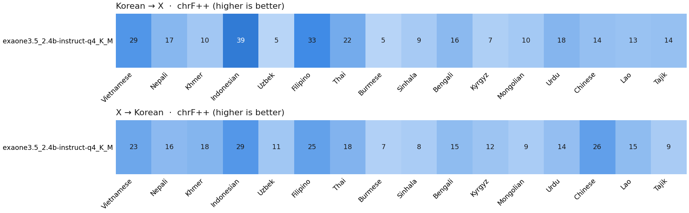

# Hamkke (함께)

*함께 means "together" in Korean.*

**Can Korea's AI models translate for everyone who works in Korea?**

Hundreds of thousands of people from Vietnam, Nepal, Cambodia, Uzbekistan, Myanmar and other
countries work in Korea. Korean companies are building their own AI models (EXAONE, HyperCLOVA X,
Kanana, Solar), but these are mostly tested on Korean, English, Japanese and Chinese.

This project measures how well AI models translate between **Korean and 19 languages spoken by
Korea's foreign workforce**, and tries to make a small model better at the weakest ones.

## First results (work in progress)

LG's EXAONE 3.5 2.4B, run locally, first 20 sentences per language. Score = chrF++ (0–100,
higher is better; roughly 45+ is usable).



- Average: **16** Korean → X, **16** X → Korean
- Best: Indonesian (39), Filipino (33), Vietnamese (29)
- Nearly unusable: **Uzbek (5), Burmese (5)**, Kyrgyz, Sinhala, Mongolian

Example: *"mice that were cured of diabetes"* became *"a 4-month-old loach fish"* in Vietnamese.

Full table: [results.md](results.md). Every raw model output is in [runs/](runs/).

## How it works

1. **Test data:** [FLORES-200](https://github.com/facebookresearch/flores), the same sentences
   professionally translated into 200 languages.
2. **Benchmark** ([bench.py](bench.py)): sends each sentence to a model (local via Ollama, or any
   OpenAI-compatible API), both directions, and scores the result with chrF++.
3. **Improve** ([finetune.py](finetune.py)): collects Korean–X sentence pairs from
   [OPUS](https://opus.nlpl.eu), removes junk and mismatched pairs (LaBSE similarity), removes all
   test sentences, and trains a LoRA adapter on a small open model. Runs on a free Colab GPU:
   [finetune_colab.ipynb](finetune_colab.ipynb).

## Run it

```bash
pip install -r requirements.txt
python bench.py run --model exaone3.5:2.4b-instruct-q4_K_M --n 50   # any Ollama model
python bench.py report --n 50                                        # table + chart
python test_bench.py                                                 # self-check
```

## Next

- Korean open models (Kanana, HyperCLOVA X SEED, EXAONE 4.0) and large baselines (Llama 70B, Gemini)
- Fine-tuned model for Khmer, Nepali and Burmese
- A small test set of real workplace-safety sentences
